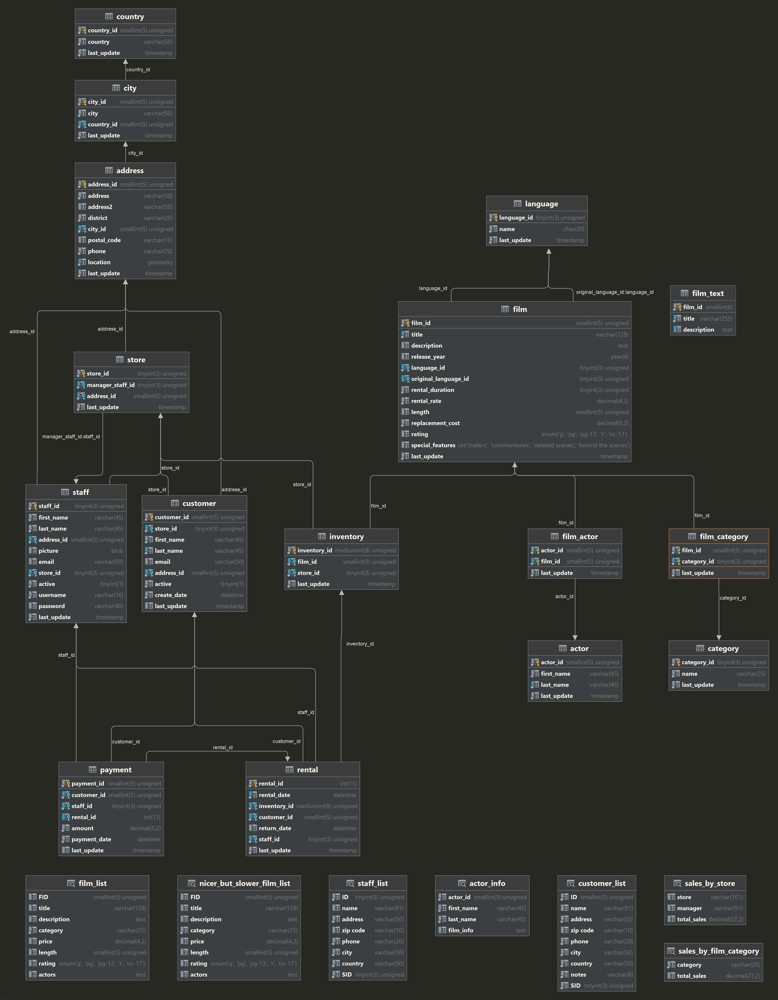

# Sakila (sakila-original branch)

This project has been created to practice query builder using
the [Sakila MySQL database](https://dev.mysql.com/doc/sakila/en/). It is based on the YouTube
series [Laravel Query Builder by codemystif](https://www.youtube.com/watch?v=AGT8bCde8XU&list=PLkyrdyGDWthC-yd9n8R3CEauJC4sFl-kj)

Note: The database used on this branch is **not** compatible with the database created on the main branch. This branch 
is used for experiments with the original Sakila database, using query builder. The main branch uses eloquent models. 
See below for more information on how to download the Sakila database from Oracle. This branch's database configured in 
the **.env** should point to the original sakila database.

## Requirements

This is a Laravel 9 project. The installation is similar to a new Laravel 9 project.

- [PHP 8.0+](https://www.php.net/downloads.php)
- [Composer](https://getcomposer.org)

Recommended:

- [Git](https://git-scm.com/downloads)

## Clone

See [Cloning a repository](https://help.github.com/en/articles/cloning-a-repository) for details on how to create a
local copy of this project on your computer.

e.g.

```sh
git clone git@github.com:Pen-y-Fan/sakila.git
```

## Install

Install all the dependencies using composer

```sh
cd sakila
composer install
```

## Create .env

Create an `.env` file from `.env.example`

```shell script
composer post-root-package-install
```

## Generate APP_KEY

Generate an APP_KEY using the artisan command

```shell script
php artisan key:generate
```

## Install Database

View [Sakila Sample Database / Installation](https://dev.mysql.com/doc/sakila/en/sakila-installation.html) for detailed
instructions on how to download and install the Sakila database.

## Configure Laravel

Once the Sakila database has been created on your MySQL server (the Sakila database in **only** compatible with MySQL 
servers), configure the Laravel **.env** file with the database name, updating username and password as per you set up.

```text
DB_CONNECTION=mysql
DB_HOST=127.0.0.1
DB_PORT=3306
DB_DATABASE=sakila
DB_USERNAME=YourDatabaseUserName
DB_PASSWORD=YourDatabaseUserPassword
```

## Run tests

To make it easy to run all the PHPUnit tests a composer script has been created in composer.json. From the root of the
projects, run:

```shell script
composer tests
```

You should see the results in testDoc format:

```text
PHPUnit 9.5.10 by Sebastian Bergmann and contributors.

Example (Tests\Unit\Example)
 ✔ Example

Example (Tests\Feature\Example)
 ✔ Example

Exploring Further The Where Keywords (Tests\Feature\ExploringFurtherTheWhereKeywords)
 ✔ Where in example
 ✔ Ten films with replacement cost between 1999 and 2099
 ✔ Ten films with replacement cost not between 1899 and 2099
 ✔ African egg or agent truman

Exploring Sub Queries Using Builder Query (Tests\Feature\ExploringSubQueriesUsingBuilderQuery)
 ✔ Display the titles of movies with the letters k and q
 ✔ Display the titles of movies with the letters k and q whose language is english

Translating Raw Sql Query Using Query Builder (Tests\Feature\TranslatingRawSqlQueryUsingQueryBuilder)
 ✔ Raw sql to query builder

Understanding Joins In Sql And Translating Them In Query Builder (Tests\Feature\UnderstandingJoinsInSqlAndTranslatingThemInQueryBuilder)
 ✔ Joining staff to address to city to country

Understanding The Usage Of Where Keyword (Tests\Feature\UnderstandingTheUsageOfWhereKeyword)
 ✔ Operator defaults to equals
 ✔ Where clauses can be chained
 ✔ Where clause can be an array
 ✔ Where clause can be a closure
 ✔ Where with order by and group by

Using Joins And Conditionals In Query Builder (Tests\Feature\UsingJoinsAndConditionalsInQueryBuilder)
 ✔ Count of film categories
 ✔ Count of film categories using closure

Writing AComplex Query Of Joining Results From Two Sub Queries (Tests\Feature\WritingAComplexQueryOfJoiningResultsFromTwoSubQueries)
 ✔ Display each store id city country and sales
```

## Log file

A log of the results from each test is also output to storage > logs > **laravel.log**

## UML diagram

A UML diagram in png format has been created in the docs folder.



## Contributing

This is a **personal project**. Contributions are **not** required. Anyone interested in developing this project are
welcome to fork or clone for your own use.

## Credits

- [Michael Pritchard \(AKA Pen-y-Fan\)](https://github.com/pen-y-fan).

## License

MIT License (MIT). Please see [License File](LICENSE.md) for more information.

The contents of the **sakila-schema.sql** and **sakila-data.sql** files are licensed under the New BSD license, the
database needs to be downloaded separately, see Install Database above.
